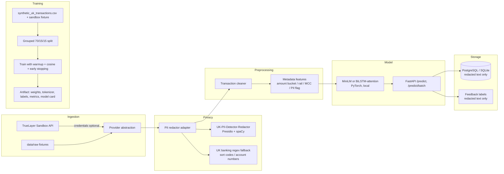

# UK Merchant Categoriser

A **privacy-first, local machine-learning service** that categorises messy UK
bank transaction descriptions without calling any closed-source LLM API.

> **Positioning.** This is a **proof of concept trained on synthetic and
> sandbox data**. It does not claim production-grade performance on real
> consumer banking data. Real data would require informed user consent and
> privacy controls. All reported scores are synthetic/sandbox evaluation
> results.

## The problem

UK bank feeds are noisy. A single coffee purchase can appear as
`CARD PAYMENT COSTA 4832 LONDON 14/09`, `SQ *COFFEE HOUSE MANCHESTER`, or
`POS COSTA COFFEE`. PII can hide in the description itself:

```
BACS JOHN SMITH 20-45-67 12345678 RENT SEPTEMBER
```

This project redacts the PII **first**, then classifies the cleaned text into
21 UK-specific spending categories, all locally.

Example inputs → outputs:

| Raw description | PII redacted? | Category |
|---|---|---|
| `TESCO STORES 5432 LONDON` | no PII | Groceries |
| `SQ *COFFEE HOUSE MANCHESTER` | no PII | Coffee Shops |
| `TFL TRAVEL CHARGE` | no PII | Transport |
| `DD BRITISH GAS` | no PII | Utilities |
| `PAYPAL *NETFLIX.COM` | no PII | Subscriptions |
| `BACS ACME LIMITED PAYROLL` | no PII | Salary |
| `TFR TO SAVINGS 220912` | no PII | Transfers |
| `BACS JOHN SMITH 20-45-67 12345678 RENT SEPTEMBER` | `[PERSON] [SORT_CODE] [ACCOUNT_NUMBER]` | Rent/Mortgage |

## Why local classification instead of an LLM API

* **Privacy** — bank descriptions can contain names, sort codes, account
  numbers and addresses. Sending them to a hosted LLM API creates a data
  transfer and a third-party processing risk. Local inference keeps the text on
  the machine.
* **Cost and latency** — a 384-dim MiniLM embedding plus a small MLP head runs
  in milliseconds on CPU.
* **Determinism and control** — the vocabulary, model card, and redaction rules
  are versioned in this repository and can be audited.
* **No external calls** — the service makes no external LLM inference calls;
  the only outbound call is the optional TrueLayer sandbox ingestion.

## Architecture



## Repository structure

```
uk-merchant-categoriser/
├── README.md
├── pyproject.toml
├── docker-compose.yml
├── Dockerfile
├── .env.example
├── Makefile
├── alembic/                  # SQLAlchemy migrations
├── src/
│   ├── api/                  # FastAPI endpoints and schemas
│   ├── ingestion/            # Provider abstraction + TrueLayer sandbox
│   ├── models/               # Base interface, MiniLM, BiLSTM-attention
│   ├── preprocessing/        # Transaction cleaner and feature extraction
│   ├── privacy/              # PII redactor adapter (+ vendored upstream)
│   ├── training/             # Train, evaluate, config, metrics, run logger
│   └── database/             # Models, session, data deletion
├── data/
│   ├── raw/                  # Committed synthetic + sandbox fixtures
│   └── processed/            # Redacted/cleaned training data (gitignored)
├── artifacts/                # Trained artifacts (gitignored)
├── tests/
├── scripts/
├── docs/                     # architecture.md, privacy.md, model-card.md
└── notebooks/                # 01_exploration.ipynb, 02_model_evaluation.ipynb
```

## Setup

Requires Python 3.10+.

```bash
git clone <this-repo> && cd uk-merchant-categoriser
make install            # creates .venv, installs the package in editable mode
```

To also install the optional presidio/spaCy stack used by the vendored
UK-PII-Detector-Redactor:

```bash
make install-pii        # installs presidio-analyzer, presidio-anonymizer, spacy
                        # and downloads en_core_web_sm
```

Without the optional PII stack the service still works: the adapter falls back
to a deterministic UK banking regex redactor.

## Run in fixture mode (no credentials)

Fixture mode is the default and needs no API keys, no database server, and no
`.env` file:

```bash
# 1. (Re)generate the synthetic dataset and TrueLayer sandbox fixture
make data

# 2. Train the default MiniLM model on synthetic/sandbox data
make train               # -> artifacts/current/

# 3. Launch the API
make api
```

Then open http://localhost:8000/docs.

Until a model is trained the API serves a clearly-labelled deterministic
`bootstrap` keyword model so `/predict` still responds.

### Example curl request

```bash
curl -s http://localhost:8000/predict -X POST \
  -H 'Content-Type: application/json' \
  -d '{
    "description": "CARD PAYMENT TESCO STORES 3402 LONDON",
    "amount": 42.65,
    "currency": "GBP",
    "direction": "debit",
    "transaction_type": "CARD",
    "mcc": null
  }'
```

Response:

```json
{
  "predicted_category": "Groceries",
  "confidence": 0.94,
  "top_3_predictions": [
    {"category": "Groceries", "confidence": 0.94},
    {"category": "Shopping", "confidence": 0.04},
    {"category": "Dining", "confidence": 0.01}
  ],
  "redacted_description": "CARD PAYMENT TESCO STORES 3402 LONDON",
  "cleaned_description": "TESCO STORES LONDON",
  "pii_entities_redacted": [],
  "requires_review": false,
  "model_version": "1.0.0"
}
```

`requires_review` becomes `true` when confidence is below 0.75
(`UKMC_CONFIDENCE_THRESHOLD`).

## Connect to the TrueLayer Data API Sandbox

1. Create sandbox credentials at https://console.truelayer.com/.
2. Copy `.env.example` to `.env` and fill in:

```bash
UKMC_FIXTURE_MODE=false
UKMC_TRUELAYER_CLIENT_ID=your-sandbox-client-id
UKMC_TRUELAYER_CLIENT_SECRET=your-sandbox-client-secret
UKMC_TRUELAYER_REDIRECT_URI=your-redirect-uri
UKMC_TRUELAYER_BANK_BASE_URL=https://api.truelayer-sandbox.com
```

3. The provider calls `POST /connect/token`, `GET /data/v1/accounts`, and
   `GET /data/v1/accounts/{id}/transactions`, and normalises each transaction
   through `normalise_transaction()`.

Never commit `.env`, credentials, or access tokens.

## Train the model

```bash
make train-minilm      # default model: MiniLM embeddings + metadata + MLP head
make train-bilstm      # educational baseline: BPE/BiLSTM/attention from scratch
make evaluate          # test metrics, confusion matrix, confidence plot, errors CSV
```

Training details:

* stratified **70/15/15** split, grouped by merchant signature so
  near-duplicate descriptions cannot leak between splits
* `CrossEntropyLoss` with class weights computed **only** on the training split
* `AdamW` with linear warmup and cosine decay
* early stopping on **validation macro F1**
* best checkpoint saved as a full artifact: weights, tokenizer/text encoder,
  label mapping, preprocessing config, metrics, and a generated model card
* runs are tracked in `artifacts/runs/runs.jsonl` (lightweight, MLflow-free)

## How the PII redactor is integrated

`src/privacy/redactor_adapter.py` is the single choke point for redaction.

* It calls the vendored
  [UK-PII-Detector-Redactor](https://github.com/EmmaExcel/UK-PII-Detector-Redactor)
  (`PiiEngine.redact_text`, Presidio + spaCy + UK NHS/NINO/postcode/phone
  recognisers) unchanged when the optional dependencies are installed.
* It layers a deterministic UK banking regex backend for identifiers the
  upstream project does not cover — **sort codes** (`20-45-67`) and **account
  numbers**.
* It maps upstream entity types onto this project's canonical placeholders:
  `[PERSON]`, `[SORT_CODE]`, `[ACCOUNT_NUMBER]`, `[EMAIL]`, `[PHONE]`,
  `[ADDRESS]`.
* It fails safe: if redaction fails it returns a controlled
  `[REDACTION_ERROR]` and never logs raw PII.
* It is replaceable: implement the `RedactorBackend` protocol and pass
  `backends=[...]` to `RedactorAdapter`.

See `src/privacy/vendor/ATTRIBUTION.md` for the vendored-code attribution.

## Privacy approach and limitations

* Raw descriptions are redacted **before** preprocessing, persistence, training,
  evaluation exports, and error reporting.
* The database stores only `redacted_description` and `cleaned_description`.
* Feedback accepts and stores only redacted text.
* Raw ingestion files stay in `data/raw` (synthetic only) and are kept separate
  from the processed training dataset.
* All secrets come from environment variables; `.env` is gitignored and
  `.env.example` never contains credentials.
* A data-deletion function is provided for a user/transaction identifier:
  `DELETE /data/{subject_id}` or `database.deletion.delete_subject_data()`.
* **Pseudonymised data can still be personal data** and must be protected.
  See `docs/privacy.md`.

Honest limitations:

* Synthetic merchants and descriptions do not capture the long tail of real UK
  transaction data.
* The merchant-grouped test split contains merchants unseen in training;
  real-world generalisation is likely lower than the reported test scores.
* Regex redaction is a safety net, not a substitute for human review; novel
  PII formats may be missed.
* The model is a proof of concept, not a production-grade categoriser.

## Future improvements

* Train on consented, redacted real data with an approved privacy review.
* Feedback-driven retraining from `/feedback` labels (redacted text only).
* Add a UK postcode/address-specific recogniser upstream and richer entity
  coverage.
* Serve via ONNX or `torch.jit` for smaller footprint and faster CPU inference.

## Tests

```bash
make test
```

The suite covers the redactor adapter, cleaning rules, feature extraction,
label validation, model forward passes, Top-3 accuracy, API responses, and a
proof that raw descriptions are never written to logs or persisted after
redaction.

## Docker

```bash
docker compose up --build
```

The API image ships the PII stack and pre-downloaded MiniLM encoder. On first
start, if no artifact exists, the entrypoint trains the default MiniLM model on
the bundled synthetic/sandbox data, runs Alembic migrations against PostgreSQL,
and then starts uvicorn on port 8000.
